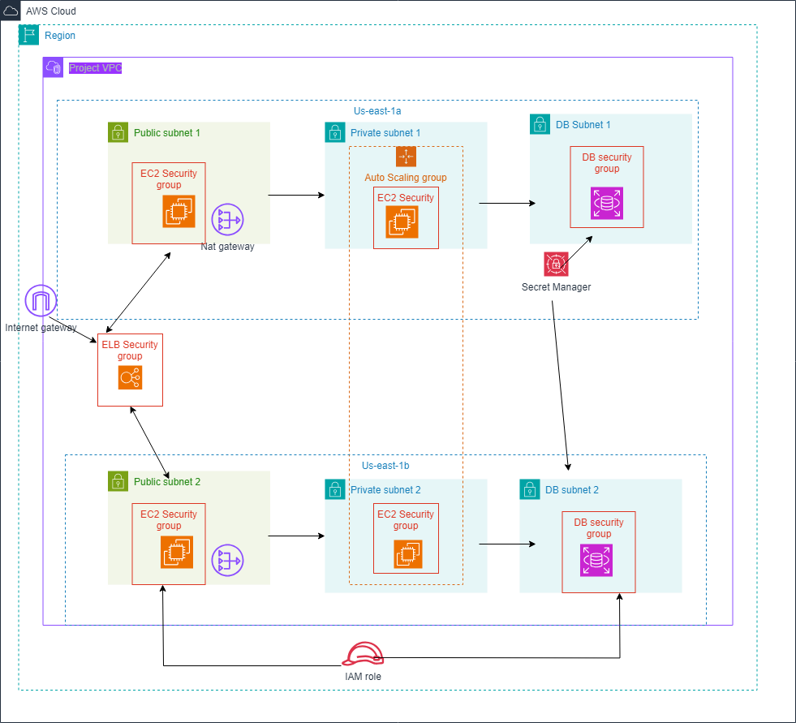

# Architecture Diagram for AWS Academy Cloud Architecting Capstone Project

## Project Overview
This repository contains the architecture diagram for the Cloud Architecting Capstone Project, demonstrating a highly available, scalable, and secure AWS solution.

## Architecture Description
The solution utilizes the following key components:
1. **Amazon VPC**: Provides a secure and isolated network environment, divided into public and private subnets for controlled access.
2. **Application Load Balancer (ALB)**: Routes traffic to multiple EC2 instances in private subnets for improved load distribution and availability.
3. **Amazon RDS**: Hosts a MySQL database with a Multi-AZ deployment for increased fault tolerance and availability.
4. **Amazon EC2**: Runs the PHP web application within private subnets, managed by an Auto Scaling Group for automatic scaling based on traffic demands.
5. **Elastic Load Balancing**: Enhances availability by balancing incoming traffic across multiple EC2 instances.
6. **AWS Secrets Manager**: Secures database credentials, ensuring encrypted and seamless access by EC2 instances.
7. **IAM Roles and Policies**: Provide necessary permissions to access services while maintaining least-privilege security practices.

## Architecture Diagram

*(Replace with the path to your uploaded architecture image file)*

## Deployment Notes
- **Security**: The architecture leverages private subnets for hosting EC2 instances and RDS, with public subnets used only for the ALB. Security groups and Network Access Control Lists (NACLs) are configured to enforce strict traffic control.
- **Scalability**: An Auto Scaling Group manages the scaling of EC2 instances to adapt to traffic loads, ensuring high availability.
- **Database**: Amazon RDS for MySQL is configured with Multi-AZ for resilience, using 20GB of General Purpose SSD storage.
- **Secrets Management**: AWS Secrets Manager is integrated for secure database credentials management, reducing hard-coded secrets.
- **Monitoring**: Amazon CloudWatch is utilized for tracking logs and performance metrics to monitor application health and resource utilization.

## Cost Considerations
- **EC2 Instances**: 2 t3.micro instances with on-demand pricing ($15.18/month).
- **Amazon RDS**: db.t3.micro instance, Multi-AZ configuration ($29.42/month).
- **Elastic Load Balancing**: ALB for routing traffic ($18.47/month).
- **AWS Secrets Manager**: Storing secrets ($0.40/month).
- **Total Estimated Cost**: Approximately $63.47/month based on previous estimates.

## Updates
The architecture diagram and deployment will be refined iteratively based on project feedback and new requirements.

## Additional Resources
For a detailed explanation of the architecture and related AWS best practices, refer to the [AWS Documentation](https://docs.aws.amazon.com).
