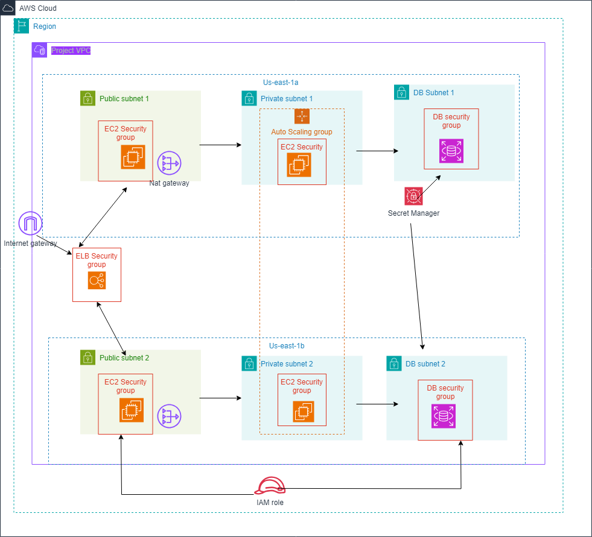

# AWS-Cloud-Architecting-Project
A repository for the final capstone project of the AWS Academy Cloud Architecting Course.

## Introduction  
### 1. Project Title  
**Cloud Architecting Capstone Project: Scalable and Secure Research Data Platform**

---

### 2. Project Overview  
This project is designed to implement a robust cloud architecture for hosting a research data platform that provides global development statistics. The platform ensures high availability, scalability, and secure data access, leveraging various AWS services for optimal performance.

**Checklist:**  
- Solves the problem of a responsive and secure data platform for researchers.
- Provides a scalable, cost-effective solution with automated scaling and redundancy.
- Implements an architecture centered around Amazon EC2, RDS, and Elastic Load Balancing.

---

## Architecture Diagram  
  
*(Ensure to replace with the path to your architecture image file)*

**Checklist:**  
- The diagram includes key components: VPC, public/private subnets, ALB, EC2 instances, RDS, Secrets Manager.
- Security measures like IAM roles and security groups are indicated.
- Data flow between ALB, EC2 instances, and the database is illustrated.

---

## Features and Functionality  
### 1. Key Features  
- **Autoscaling**: Automatically scales EC2 instances based on traffic.
- **High Availability**: Multi-AZ deployment for database and load-balanced EC2 instances.
- **Security**: Integrated with AWS Secrets Manager for secure database credential handling.

### 2. AWS Services Used  
- **Amazon VPC**: Isolated environment for hosting the application.
- **Elastic Load Balancing (ALB)**: Routes traffic across multiple EC2 instances.
- **Amazon EC2**: Hosts the PHP web application within private subnets.
- **Amazon RDS (MySQL)**: Multi-AZ deployment for database availability.
- **AWS Secrets Manager**: Securely stores and manages database credentials.
- **IAM Roles and Policies**: Grants least-privilege access to resources.

---

## Deployment  
### 1. Prerequisites  
- **AWS CLI** installed and configured.
- IAM user with sufficient privileges.
- Access to PHP application code and the database dump file.

### 2. Step-by-Step Deployment Instructions  
1. **Set up the VPC** and configure subnets.
2. **Deploy Amazon RDS** with Multi-AZ and secure access.
3. **Create an Application Load Balancer** in public subnets.
4. **Launch EC2 instances** using an Auto Scaling Group.
5. **Store and access credentials** with AWS Secrets Manager.
6. **Configure security groups** for EC2 and RDS.
7. **Test the application** using the load balancer URL.

**Checklist:**  
- Include manual setup instructions in the AWS Management Console.
- Use templates or scripts if applicable.

---

## Security  
- **IAM Roles**: Grant appropriate access with least-privilege principles.
- **Secrets Manager**: Used to manage and access sensitive data securely.
- **Network Security**: Configured security groups and NACLs to control inbound/outbound traffic.

---

## Testing and Validation  
### 1. Testing Strategy  
- **Load Testing**: Conducted to verify autoscaling and application performance under load.
- **Data Integrity**: Validated by running queries and comparing imported data with expected results.

**Checklist:**  
- Commands or scripts for validation can be included.
- Test cases such as failover or simulated load scenarios.

---

## Challenges and Learnings  
- **Challenge**: Ensuring proper traffic routing through the ALB.
- **Learning**: Improved understanding of cross-AZ traffic distribution and security group configurations.

---

## Future Improvements  
- **CI/CD Integration**: Implement AWS CodePipeline for automated deployments.
- **Enhanced Monitoring**: Use CloudWatch Insights for more detailed metrics and log analysis.

---

## Contributors  

- **Manasses Mburu Mwituria** - Final implementation and deployment.

---

## License  
This project is licensed under the MIT License.
